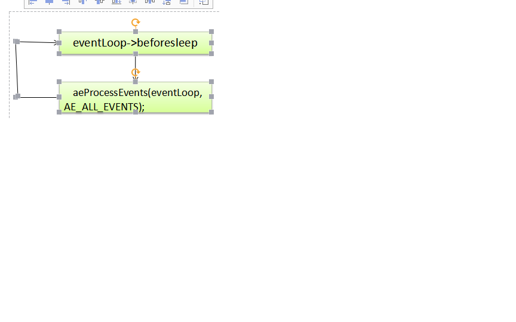

```
sofdhttps://redis.io/
```

http://redisdoc.com/ redis命令的翻译版

https://github.com/josiahcarlson/redis-in-action redis in action代码目录


<redis的设计与实现>

集群   sentinal

-------------------------------------------------------------------------------------------------------------------------

单机数据库                 订阅与发布      lua    事物

———————————————————————————————————————————

redis数据结构                   redisNIO、同步异步          控制逻辑            异常处理       


了Redis的内部机制（比如数据库实现、类型系统、事件模型），而且还介绍了大部分Redis单机特性（比如事务、持久化、Lua脚本、排序、二进制位操作），以及所有Redis多机特性（如复制、Sentinel和集群）。


Redis is an open source (BSD licensed), in-memory data structure store, used as a database, cache and message broker. 

It supports data structures such as strings, hashes, lists, sets, sorted sets with range queries, bitmaps, hyperloglogs and geospatial indexes with radius queries. 

Redis has 

- built-in replication, 
- Lua scripting, 
- LRU eviction, transactions and 
- different levels of on-disk persistence, and provides high availability via Redis Sentinel and automatic partitioning with Redis Cluster. 


# data structure

#### list

- list adlist.h

  这是个最基本的list的实现

  

- list    quicklist.h

quicklist是双向链表 + ziplist的组合结构，既然这么设计，那么肯定是有这么做的道理，我没有看懂。ziplist压缩了数据，但是访问要频繁的操作内存，会不会很慢？

ziplist暂时放一下，但是quicklist本身应该是可以看懂的。


在这个底层就是一个双向链表，对于链表的操作。关键结构：

```
typedef struct quicklist {

    quicklistNode *head;

    quicklistNode *tail;

    unsigned long count;        /* total count of all entries in all ziplists */

    unsigned int len;           /* number of quicklistNodes */

    int fill : 16;              /* fill factor for individual nodes */

    unsigned int compress : 16; /* depth of end nodes not to compress;0=off */

} quicklist;

typedef struct quicklistNode {

    struct quicklistNode *prev;

    struct quicklistNode *next;

    unsigned char *zl;

    unsigned int sz;             /* ziplist size in bytes */

    unsigned int count : 16;     /* count of items in ziplist */

    unsigned int encoding : 2;   /* RAW==1 or LZF==2 */

    unsigned int container : 2;  /* NONE==1 or ZIPLIST==2 */

    unsigned int recompress : 1; /* was this node previous compressed? */

    unsigned int attempted_compress : 1; /* node can't compress; too small */

    unsigned int extra : 10; /* more bits to steal for future usage */

} quicklistNode;

```


在链表的本质上，增加了存储数据，压缩数据。


Redis的QuickList是个优化，双向链表 + 链表的每个节点是个字符数组（或者说一个内部协议），这样可以获取到更高的压缩率以及线性访问速度


- set的调用栈

redis_server!sdsnewlen+0x24 [c:\release\redis\src\sds.c @ 89]

redis_server!dbAdd+0x5e [c:\release\redis\src\db.c @ 162]

redis_server!setKey+0x3e [c:\release\redis\src\db.c @ 190]

redis_server!setGenericCommand+0x139 [c:\release\redis\src\t_string.c @ 87]

redis_server!setCommand+0x167 [c:\release\redis\src\t_string.c @ 140]

redis_server!call+0x90 [c:\release\redis\src\server.c @ 2282]

redis_server!processCommand+0x59d [c:\release\redis\src\server.c @ 2561]

redis_server!processInputBuffer+0x216 [c:\release\redis\src\networking.c @ 1438]

redis_server!readQueryFromClient+0x2da [c:\release\redis\src\networking.c @ 1503]

redis_server!redis_main+0x58c [c:\release\redis\src\server.c @ 4157]


#### dict

dict是hashtable的实现，整个的redis存key是使用dict存放的，dict的每个value，可以是dict、set、list、string这些结构。dict是其中最关键的数据结构。

```
typedef struct dictEntry {
    void *key;
    union {
        void *val;
        uint64_t u64;
        int64_t s64;
        double d;
    } v;
    struct dictEntry *next;
} dictEntry;

typedef struct dictType {
    unsigned int (*hashFunction)(const void *key);
    void *(*keyDup)(void *privdata, const void *key);
    void *(*valDup)(void *privdata, const void *obj);
    int (*keyCompare)(void *privdata, const void *key1, const void *key2);
    void (*keyDestructor)(void *privdata, void *key);
    void (*valDestructor)(void *privdata, void *obj);
} dictType;

/* This is our hash table structure. Every dictionary has two of this as we
 * implement incremental rehashing, for the old to the new table. */
typedef struct dictht {
    dictEntry **table;
    PORT_ULONG size;
    PORT_ULONG sizemask;
    PORT_ULONG used;
} dictht;

typedef struct dict {
    dictType *type;
    void *privdata;
    dictht ht[2];
    PORT_LONG rehashidx; /* rehashing not in progress if rehashidx == -1 */
    int iterators; /* number of iterators currently running */
} dict;

/* If safe is set to 1 this is a safe iterator, that means, you can call
 * dictAdd, dictFind, and other functions against the dictionary even while
 * iterating. Otherwise it is a non safe iterator, and only dictNext()
 * should be called while iterating. */
typedef struct dictIterator {
    dict *d;
    PORT_LONG index;
    int table, safe;
    dictEntry *entry, *nextEntry;
    /* unsafe iterator fingerprint for misuse detection. */
    PORT_LONGLONG fingerprint;
} dictIterator;
```


20181220

redis的学习结合上mysql原理感觉会事半功倍。

原理上 可以有，从server的redisServer定义可以大概看到redis支持的功能

- 内存管理
- 进程管理
- 数据结构，redis有多种数据结构
- 数据库，类似于mysql原理
  - AOF，这种可以理解为binlog AOF持久化方式记录每次对服务器写的操作,当服务器重启的时候会重新执行这些命令来恢复原始的数据,AOF命令以redis
  - RDB，这种可以理解为redolog RDB持久化方式能够在指定的时间间隔能对你的数据进行快照存储.
  - Redis 支持简单且易用的主从复制（master-slave replication）功能， 该功能可以让从服务器(slave server)成为主服务器(master server)的精确复制品 
  - Redis支持集群


学习完level1-level3后，可以以一种全新的视角来阅读源码，对于每个细节，都从原理上进行理解，这是非常了不起的事情。


--------------------------------------------------


配置：   集群、主备等

------------------------------------------------------------------

设计 

架构高可用： 集群、主备

------------------------------------------------------

数据结构

-------------------------------------------------------------------

内存管理                         线程进程                   NIO                数据库原理 ： rdb、aof       

- redis工具 redission、jedis，jedis需要自己管理连接池。


- 单进程单线程。

  当然，Redis除了处理客户端的命令请求还有诸如RDB持久化、AOF重写这样的事情要做，而在做这些事情的时候，Redis会fork子进程去完成。但对于accept客户端连接、处理客户端请求、返回命令结果等等这些，Redis是使用主进程及主线程来完成的。我们可能会惊讶Redis在使用单进程及单线程来处理请求为什么会如此高效？在回答这个问题之前，我们先来讨论一个I/O多路复用的模式--Reactor。


- 关键接口

  server.h     

  ```
  typedef struct redisObject {
      unsigned type:4;       // redis封装的对象类型
      unsigned encoding:4;   // 底层数据类型
      unsigned lru:LRU_BITS; /* lru time (relative to server.lruclock) */
      int refcount;          // 引用计数
      void *ptr;             // 具体数据
  } robj;
  
  ```

  命令： type 对应于封装的5钟对象类型

  ​            encoding对应底层数据结构，

  - zset

    ```
    typedef struct zskiplistNode {
        robj *obj;
        double score;
        struct zskiplistNode *backward;
        struct zskiplistLevel {
            struct zskiplistNode *forward;
            unsigned int span;
        } level[];
    } zskiplistNode;
    
    typedef struct zskiplist {
        struct zskiplistNode *header, *tail;
        PORT_ULONG length;
        int level;
    } zskiplist;
    
    typedef struct zset {
        dict *dict;
        zskiplist *zsl;
    } zset;
    ```

  - 

  

  

  ```
  typedef struct redisDb {   // 默认有15个db，都是以dict的方式保存在内存中
      dict *dict;                 /* The keyspace for this DB */
      dict *expires;              /* Timeout of keys with a timeout set 超期队列*/
      dict *blocking_keys;        /* Keys with clients waiting for data (BLPOP) 阻塞相关的*/
      dict *ready_keys;           /* Blocked keys that received a PUSH 阻塞相关的*/
      dict *watched_keys;         /* WATCHED keys for MULTI/EXEC CAS 是否是事物操作使用？*/
      struct evictionPoolEntry *eviction_pool;    /* Eviction pool of keys */
      int id;                     /* Database ID */
      PORT_LONGLONG avg_ttl;          /* Average TTL, just for stats */
  } redisDb;
  ```

  

```
/* Client MULTI/EXEC state */ 事物相关的操作
typedef struct multiCmd {
    robj **argv;
    int argc;
    struct redisCommand *cmd;
} multiCmd;

typedef struct multiState {
    multiCmd *commands;     /* Array of MULTI commands */
    int count;              /* Total number of MULTI commands */
    int minreplicas;        /* MINREPLICAS for synchronous replication */
    time_t minreplicas_timeout; /* MINREPLICAS timeout as unixtime. */
} multiState;
```


```
/* This structure holds the blocking operation state for a client.
 * The fields used depend on client->btype. */  阻塞相关的操作
typedef struct blockingState {
    /* Generic fields. */
    mstime_t timeout;       /* Blocking operation timeout. If UNIX current time
                             * is > timeout then the operation timed out. */

    /* BLOCKED_LIST */
    dict *keys;             /* The keys we are waiting to terminate a blocking
                             * operation such as BLPOP. Otherwise NULL. */
    robj *target;           /* The key that should receive the element,
                             * for BRPOPLPUSH. */

    /* BLOCKED_WAIT */
    int numreplicas;        /* Number of replicas we are waiting for ACK. */
    PORT_LONGLONG reploffset;   /* Replication offset to reach. */
} blockingState;

/* The following structure represents a node in the server.ready_keys list,
 * where we accumulate all the keys that had clients blocked with a blocking
 * operation such as B[LR]POP, but received new data in the context of the
 * last executed command.
 *
 * After the execution of every command or script, we run this list to check
 * if as a result we should serve data to clients blocked, unblocking them.
 * Note that server.ready_keys will not have duplicates as there dictionary
 * also called ready_keys in every structure representing a Redis database,
 * where we make sure to remember if a given key was already added in the
 * server.ready_keys list. */
typedef struct readyList {
    redisDb *db;
    robj *key;
} readyList;
```

```
server\client都是对于状态的抽象，用这两种数据结构抽象出server和client端。

typedef struct client {
    uint64_t id;            /* Client incremental unique ID. */
    int fd;                 /* Client socket. */      // 伪描述符，在aof恢复redis和lua脚本时为-1
    redisDb *db;            /* Pointer to currently SELECTed DB. */
    int dictid;             /* ID of the currently SELECTed DB. */
    robj *name;             /* As set by CLIENT SETNAME. */
    sds  querybuf;           /* Buffer we use to accumulate client queries. */ // 服务器端发送的请求缓冲
    size_t querybuf_peak;   /* Recent (100ms or more) peak of querybuf size. */
    int argc;               /* Num of arguments of current command. */
    robj **argv;            /* Arguments of current command. */    // 命令参数被解析放在这里
    struct redisCommand *cmd, *lastcmd;  /* Last command executed. */  // 参数解析后的命令放在这里
    int reqtype;            /* Request protocol type: PROTO_REQ_* */
    int multibulklen;       /* Number of multi bulk arguments left to read. */
    PORT_LONG bulklen;           /* Length of bulk argument in multi bulk request. */
    list *reply;            /* List of reply objects to send to the client. */
    PORT_ULONGLONG reply_bytes; /* Tot bytes of objects in reply list. */
    size_t sentlen;         /* Amount of bytes already sent in the current
                               buffer or object being sent. */
    time_t ctime;           /* Client creation time. */ 记录客户端连接时间
    time_t lastinteraction; /* Time of the last interaction, used for timeout */
    time_t obuf_soft_limit_reached_time;
    int flags;              /* Client flags: CLIENT_* macros. */  // 记录redis的角色和状态
    int authenticated;      /* When requirepass is non-NULL. */    // 如果设置了requirepass，则需要通过auth命令首先输入密码，通过后才能鉴权
    int replstate;          /* Replication state if this is a slave. */
    int repl_put_online_on_ack; /* Install slave write handler on ACK. */
    int repldbfd;           /* Replication DB file descriptor. */
    off_t repldboff;        /* Replication DB file offset. */
    off_t repldbsize;       /* Replication DB file size. */
    sds replpreamble;       /* Replication DB preamble. */
    PORT_LONGLONG reploff;      /* Replication offset if this is our master. */
    PORT_LONGLONG repl_ack_off; /* Replication ack offset, if this is a slave. */
    PORT_LONGLONG repl_ack_time;/* Replication ack time, if this is a slave. */
    PORT_LONGLONG psync_initial_offset; /* FULLRESYNC reply offset other slaves
                                       copying this slave output buffer
                                       should use. */
    char replrunid[CONFIG_RUN_ID_SIZE+1]; /* Master run id if is a master. */
    int slave_listening_port; /* As configured with: SLAVECONF listening-port. */
    int slave_capa;         /* Slave capabilities: SLAVE_CAPA_* bitwise OR. */
    multiState mstate;      /* MULTI/EXEC state */
    int btype;              /* Type of blocking op if CLIENT_BLOCKED. */
    blockingState bpop;     /* blocking state */
    PORT_LONGLONG woff;         /* Last write global replication offset. */
    list *watched_keys;     /* Keys WATCHED for MULTI/EXEC CAS */
    dict *pubsub_channels;  /* channels a client is interested in (SUBSCRIBE) */
    list *pubsub_patterns;  /* patterns a client is interested in (SUBSCRIBE) */
    sds peerid;             /* Cached peer ID. */
    WIN32_ONLY(char replFileCopy[_MAX_PATH];)

    /* Response buffer */ // 输出参数
    int bufpos;
    char buf[PROTO_REPLY_CHUNK_BYTES];
} client;
```

连接触发serverConn处理，创建并加入到clients


```
struct redisServer {
    /* General */
    pid_t pid;                  /* Main process pid. */
    char *configfile;           /* Absolute config file path, or NULL */
    char *executable;           /* Absolute executable file path. */
    char **exec_argv;           /* Executable argv vector (copy). */
    int hz;                     /* serverCron() calls frequency in hertz */
    redisDb *db;
    dict *commands;             /* Command table */
    dict *orig_commands;        /* Command table before command renaming. */
    aeEventLoop *el;
    unsigned lruclock:LRU_BITS; /* Clock for LRU eviction */
    int shutdown_asap;          /* SHUTDOWN needed ASAP */
    int activerehashing;        /* Incremental rehash in serverCron() */
    char *requirepass;          /* Pass for AUTH command, or NULL */
    char *pidfile;              /* PID file path */
    int arch_bits;              /* 32 or 64 depending on sizeof(PORT_LONG) */
    int cronloops;              /* Number of times the cron function run */
    char runid[CONFIG_RUN_ID_SIZE+1];  /* ID always different at every exec. */
    int sentinel_mode;          /* True if this instance is a Sentinel. */
    /* Networking */
    int port;                   /* TCP listening port */
    int tcp_backlog;            /* TCP listen() backlog */
    char *bindaddr[CONFIG_BINDADDR_MAX]; /* Addresses we should bind to */
    int bindaddr_count;         /* Number of addresses in server.bindaddr[] */
    char *unixsocket;           /* UNIX socket path */
    mode_t unixsocketperm;      /* UNIX socket permission */
    int ipfd[CONFIG_BINDADDR_MAX]; /* TCP socket file descriptors */
    int ipfd_count;             /* Used slots in ipfd[] */
    int sofd;                   /* Unix socket file descriptor */
    int cfd[CONFIG_BINDADDR_MAX];/* Cluster bus listening socket */
    int cfd_count;              /* Used slots in cfd[] */
    list *clients;              /* List of active clients */
    list *clients_to_close;     /* Clients to close asynchronously */
    list *clients_pending_write; /* There is to write or install handler. */
    list *slaves, *monitors;    /* List of slaves and MONITORs */
    client *current_client; /* Current client, only used on crash report */
    int clients_paused;         /* True if clients are currently paused */
    mstime_t clients_pause_end_time; /* Time when we undo clients_paused */
    char neterr[ANET_ERR_LEN];   /* Error buffer for anet.c */
    dict *migrate_cached_sockets;/* MIGRATE cached sockets */
    uint64_t next_client_id;    /* Next client unique ID. Incremental. */
    int protected_mode;         /* Don't accept external connections. */
    /* RDB / AOF loading information */
    int loading;                /* We are loading data from disk if true */
    off_t loading_total_bytes;
    off_t loading_loaded_bytes;
    time_t loading_start_time;
    off_t loading_process_events_interval_bytes;
    /* Fast pointers to often looked up command */
    struct redisCommand *delCommand, *multiCommand, *lpushCommand, *lpopCommand,
                        *rpopCommand, *sremCommand, *execCommand;
    /* Fields used only for stats */
    time_t stat_starttime;          /* Server start time */
    PORT_LONGLONG stat_numcommands;     /* Number of processed commands */
    PORT_LONGLONG stat_numconnections;  /* Number of connections received */
    PORT_LONGLONG stat_expiredkeys;     /* Number of expired keys */
    PORT_LONGLONG stat_evictedkeys;     /* Number of evicted keys (maxmemory) */
    PORT_LONGLONG stat_keyspace_hits;   /* Number of successful lookups of keys */
    PORT_LONGLONG stat_keyspace_misses; /* Number of failed lookups of keys */
    size_t stat_peak_memory;        /* Max used memory record */
    PORT_LONGLONG stat_fork_time;       /* Time needed to perform latest fork() */
    double stat_fork_rate;          /* Fork rate in GB/sec. */
    PORT_LONGLONG stat_rejected_conn;   /* Clients rejected because of maxclients */
    PORT_LONGLONG stat_sync_full;       /* Number of full resyncs with slaves. */
    PORT_LONGLONG stat_sync_partial_ok; /* Number of accepted PSYNC requests. */
    PORT_LONGLONG stat_sync_partial_err;/* Number of unaccepted PSYNC requests. */
    list *slowlog;                  /* SLOWLOG list of commands */
    PORT_LONGLONG slowlog_entry_id;     /* SLOWLOG current entry ID */
    PORT_LONGLONG slowlog_log_slower_than; /* SLOWLOG time limit (to get logged) */
    PORT_ULONG slowlog_max_len;     /* SLOWLOG max number of items logged */
    size_t resident_set_size;       /* RSS sampled in serverCron(). */
    PORT_LONGLONG stat_net_input_bytes; /* Bytes read from network. */
    PORT_LONGLONG stat_net_output_bytes; /* Bytes written to network. */
    /* The following two are used to track instantaneous metrics, like
     * number of operations per second, network traffic. */
    struct {
        PORT_LONGLONG last_sample_time; /* Timestamp of last sample in ms */
        PORT_LONGLONG last_sample_count;/* Count in last sample */
        PORT_LONGLONG samples[STATS_METRIC_SAMPLES];
        int idx;
    } inst_metric[STATS_METRIC_COUNT];
    /* Configuration */
    int verbosity;                  /* Loglevel in redis.conf */
    int maxidletime;                /* Client timeout in seconds */
    int tcpkeepalive;               /* Set SO_KEEPALIVE if non-zero. */
    int active_expire_enabled;      /* Can be disabled for testing purposes. */
    size_t client_max_querybuf_len; /* Limit for client query buffer length */
    int dbnum;                      /* Total number of configured DBs */
    int supervised;                 /* 1 if supervised, 0 otherwise. */
    int supervised_mode;            /* See SUPERVISED_* */
    int daemonize;                  /* True if running as a daemon */
    clientBufferLimitsConfig client_obuf_limits[CLIENT_TYPE_OBUF_COUNT];
    /* AOF persistence */
    int aof_state;                  /* AOF_(ON|OFF|WAIT_REWRITE) */
    int aof_fsync;                  /* Kind of fsync() policy */
    char *aof_filename;             /* Name of the AOF file */
    int aof_no_fsync_on_rewrite;    /* Don't fsync if a rewrite is in prog. */
    int aof_rewrite_perc;           /* Rewrite AOF if % growth is > M and... */
    off_t aof_rewrite_min_size;     /* the AOF file is at least N bytes. */
    off_t aof_rewrite_base_size;    /* AOF size on latest startup or rewrite. */
    off_t aof_current_size;         /* AOF current size. */
    int aof_rewrite_scheduled;      /* Rewrite once BGSAVE terminates. */
    pid_t aof_child_pid;            /* PID if rewriting process */
    list *aof_rewrite_buf_blocks;   /* Hold changes during an AOF rewrite. */
    sds aof_buf;      /* AOF buffer, written before entering the event loop */
    int aof_fd;       /* File descriptor of currently selected AOF file */
    int aof_selected_db; /* Currently selected DB in AOF */
    time_t aof_flush_postponed_start; /* UNIX time of postponed AOF flush */
    time_t aof_last_fsync;            /* UNIX time of last fsync() */
    time_t aof_rewrite_time_last;   /* Time used by last AOF rewrite run. */
    time_t aof_rewrite_time_start;  /* Current AOF rewrite start time. */
    int aof_lastbgrewrite_status;   /* C_OK or C_ERR */
    PORT_ULONG aof_delayed_fsync;  /* delayed AOF fsync() counter */
    int aof_rewrite_incremental_fsync;/* fsync incrementally while rewriting? */
    int aof_last_write_status;      /* C_OK or C_ERR */
    int aof_last_write_errno;       /* Valid if aof_last_write_status is ERR */
    int aof_load_truncated;         /* Don't stop on unexpected AOF EOF. */
    /* AOF pipes used to communicate between parent and child during rewrite. */
    int aof_pipe_write_data_to_child;
    int aof_pipe_read_data_from_parent;
    int aof_pipe_write_ack_to_parent;
    int aof_pipe_read_ack_from_child;
    int aof_pipe_write_ack_to_child;
    int aof_pipe_read_ack_from_parent;
    int aof_stop_sending_diff;     /* If true stop sending accumulated diffs
                                      to child process. */
    sds aof_child_diff;             /* AOF diff accumulator child side. */
    /* RDB persistence */
    PORT_LONGLONG dirty;                /* Changes to DB from the last save */
    PORT_LONGLONG dirty_before_bgsave;  /* Used to restore dirty on failed BGSAVE */
    pid_t rdb_child_pid;            /* PID of RDB saving child */
    struct saveparam *saveparams;   /* Save points array for RDB */
    int saveparamslen;              /* Number of saving points */
    char *rdb_filename;             /* Name of RDB file */
    int rdb_compression;            /* Use compression in RDB? */
    int rdb_checksum;               /* Use RDB checksum? */
    time_t lastsave;                /* Unix time of last successful save */
    time_t lastbgsave_try;          /* Unix time of last attempted bgsave */
    time_t rdb_save_time_last;      /* Time used by last RDB save run. */
    time_t rdb_save_time_start;     /* Current RDB save start time. */
    int rdb_child_type;             /* Type of save by active child. */
    int lastbgsave_status;          /* C_OK or C_ERR */
    int stop_writes_on_bgsave_err;  /* Don't allow writes if can't BGSAVE */
    int rdb_pipe_write_result_to_parent; /* RDB pipes used to return the state */
    int rdb_pipe_read_result_from_child; /* of each slave in diskless SYNC. */
    /* Propagation of commands in AOF / replication */
    redisOpArray also_propagate;    /* Additional command to propagate. */
    /* Logging */
    char *logfile;                  /* Path of log file */
    int syslog_enabled;             /* Is syslog enabled? */
    char *syslog_ident;             /* Syslog ident */
    POSIX_ONLY(int syslog_facility;)            /* Syslog facility */
    /* Replication (master) */
    int slaveseldb;                 /* Last SELECTed DB in replication output */
    PORT_LONGLONG master_repl_offset;   /* Global replication offset */
    int repl_ping_slave_period;     /* Master pings the slave every N seconds */
    char *repl_backlog;             /* Replication backlog for partial syncs */
    PORT_LONGLONG repl_backlog_size;    /* Backlog circular buffer size */
    PORT_LONGLONG repl_backlog_histlen; /* Backlog actual data length */
    PORT_LONGLONG repl_backlog_idx;     /* Backlog circular buffer current offset */
    PORT_LONGLONG repl_backlog_off;     /* Replication offset of first byte in the
                                       backlog buffer. */
    time_t repl_backlog_time_limit; /* Time without slaves after the backlog
                                       gets released. */
    time_t repl_no_slaves_since;    /* We have no slaves since that time.
                                       Only valid if server.slaves len is 0. */
    int repl_min_slaves_to_write;   /* Min number of slaves to write. */
    int repl_min_slaves_max_lag;    /* Max lag of <count> slaves to write. */
    int repl_good_slaves_count;     /* Number of slaves with lag <= max_lag. */
    int repl_diskless_sync;         /* Send RDB to slaves sockets directly. */
    int repl_diskless_sync_delay;   /* Delay to start a diskless repl BGSAVE. */
    /* Replication (slave) */
    char *masterauth;               /* AUTH with this password with master */
    char *masterhost;               /* Hostname of master */
    int masterport;                 /* Port of master */
    int repl_timeout;               /* Timeout after N seconds of master idle */
    client *master;     /* Client that is master for this slave */
    client *cached_master; /* Cached master to be reused for PSYNC. */
    int repl_syncio_timeout; /* Timeout for synchronous I/O calls */
    int repl_state;          /* Replication status if the instance is a slave */
    off_t repl_transfer_size; /* Size of RDB to read from master during sync. */
    off_t repl_transfer_read; /* Amount of RDB read from master during sync. */
    off_t repl_transfer_last_fsync_off; /* Offset when we fsync-ed last time. */
    int repl_transfer_s;     /* Slave -> Master SYNC socket */
    int repl_transfer_fd;    /* Slave -> Master SYNC temp file descriptor */
    char *repl_transfer_tmpfile; /* Slave-> master SYNC temp file name */
    time_t repl_transfer_lastio; /* Unix time of the latest read, for timeout */
    int repl_serve_stale_data; /* Serve stale data when link is down? */
    int repl_slave_ro;          /* Slave is read only? */
    time_t repl_down_since; /* Unix time at which link with master went down */
    int repl_disable_tcp_nodelay;   /* Disable TCP_NODELAY after SYNC? */
    int slave_priority;             /* Reported in INFO and used by Sentinel. */
    char repl_master_runid[CONFIG_RUN_ID_SIZE+1];  /* Master run id for PSYNC. */
    PORT_LONGLONG repl_master_initial_offset;         /* Master PSYNC offset. */
    /* Replication script cache. */
    dict *repl_scriptcache_dict;        /* SHA1 all slaves are aware of. */
    list *repl_scriptcache_fifo;        /* First in, first out LRU eviction. */
    unsigned int repl_scriptcache_size; /* Max number of elements. */
    /* Synchronous replication. */
    list *clients_waiting_acks;         /* Clients waiting in WAIT command. */
    int get_ack_from_slaves;            /* If true we send REPLCONF GETACK. */
    /* Limits */
    unsigned int maxclients;            /* Max number of simultaneous clients */
    PORT_ULONGLONG maxmemory;   /* Max number of memory bytes to use */
    int maxmemory_policy;           /* Policy for key eviction */
    int maxmemory_samples;          /* Pricision of random sampling */
    /* Blocked clients */
    unsigned int bpop_blocked_clients; /* Number of clients blocked by lists */
    list *unblocked_clients; /* list of clients to unblock before next loop */
    list *ready_keys;        /* List of readyList structures for BLPOP & co */
    /* Sort parameters - qsort_r() is only available under BSD so we
     * have to take this state global, in order to pass it to sortCompare() */
    int sort_desc;
    int sort_alpha;
    int sort_bypattern;
    int sort_store;
    /* Zip structure config, see redis.conf for more information  */
    size_t hash_max_ziplist_entries;
    size_t hash_max_ziplist_value;
    size_t set_max_intset_entries;
    size_t zset_max_ziplist_entries;
    size_t zset_max_ziplist_value;
    size_t hll_sparse_max_bytes;
    /* List parameters */
    int list_max_ziplist_size;
    int list_compress_depth;
    /* time cache */
    time_t unixtime;        /* Unix time sampled every cron cycle. */   // 100ms执行一次，为避免
                                                                           重复执行，因此将时间设置在这里缓存。                                             
    PORT_LONGLONG mstime;       /* Like 'unixtime' but with milliseconds resolution. */
    /* Pubsub */
    dict *pubsub_channels;  /* Map channels to list of subscribed clients */
    list *pubsub_patterns;  /* A list of pubsub_patterns */
    int notify_keyspace_events; /* Events to propagate via Pub/Sub. This is an
                                   xor of NOTIFY_... flags. */
    /* Cluster */
    int cluster_enabled;      /* Is cluster enabled? */
    mstime_t cluster_node_timeout; /* Cluster node timeout. */
    char *cluster_configfile; /* Cluster auto-generated config file name. */
    struct clusterState *cluster;  /* State of the cluster */
    int cluster_migration_barrier; /* Cluster replicas migration barrier. */
    int cluster_slave_validity_factor; /* Slave max data age for failover. */
    int cluster_require_full_coverage; /* If true, put the cluster down if
                                          there is at least an uncovered slot.*/
    /* Scripting */
    lua_State *lua; /* The Lua interpreter. We use just one for all clients */
    client *lua_client;   /* The "fake client" to query Redis from Lua */  // 整个生命周期一直存在
    client *lua_caller;   /* The client running EVAL right now, or NULL */
    dict *lua_scripts;         /* A dictionary of SHA1 -> Lua scripts */
    mstime_t lua_time_limit;  /* Script timeout in milliseconds */
    mstime_t lua_time_start;  /* Start time of script, milliseconds time */
    int lua_write_dirty;  /* True if a write command was called during the
                             execution of the current script. */
    int lua_random_dirty; /* True if a random command was called during the
                             execution of the current script. */
    int lua_replicate_commands; /* True if we are doing single commands repl. */
    int lua_multi_emitted;/* True if we already proagated MULTI. */
    int lua_repl;         /* Script replication flags for redis.set_repl(). */
    int lua_timedout;     /* True if we reached the time limit for script
                             execution. */
    int lua_kill;         /* Kill the script if true. */
    int lua_always_replicate_commands; /* Default replication type. */
    /* Latency monitor */
    PORT_LONGLONG latency_monitor_threshold;
    dict *latency_events;
    /* Assert & bug reporting */
    char *assert_failed;
    char *assert_file;
    int assert_line;
    int bug_report_start; /* True if bug report header was already logged. */
    int watchdog_period;  /* Software watchdog period in ms. 0 = off */
    /* System hardware info */
    size_t system_memory_size;  /* Total memory in system as reported by OS */
};
```

每个连接过来，需要创建一个client，整体结构是一种server、client的模式。这两个类是redis最重要的数据结构。

1. 有LUA和AOF两种伪客户端，其中LUA长期存在，而AOF用完就关。
2. 客户端中有服务区缓冲，大于缓冲则


服务器端：

1. 初始化
2. AOF还原
3. servConn运转


```
struct redisCommand {   // redis命令
    char *name;
    redisCommandProc *proc;
    int arity;
    char *sflags; /* Flags as string representation, one char per flag. */   // 命令类型，读写
    int flags;    /* The actual flags, obtained from the 'sflags' field. */  // 从sFlag中解析的flag
    /* Use a function to determine keys arguments in a command line.
     * Used for Redis Cluster redirect. */
    redisGetKeysProc *getkeys_proc;
    /* What keys should be loaded in background when calling this command? */
    int firstkey; /* The first argument that's a key (0 = no keys) */
    int lastkey;  /* The last argument that's a key */
    int keystep;  /* The step between first and last key */
    PORT_LONGLONG microseconds, calls;
};
```


```
typedef struct pubsubPattern {  // 订阅的实现
    client *client;
    robj *pattern;
} pubsubPattern;
typedef struct _redisSortOperation {
    int type;
    robj *pattern;
} redisSortOperation;

```


```
/* Structure to hold list iteration abstraction. */
typedef struct {
    robj *subject;
    unsigned char encoding;
    unsigned char direction; /* Iteration direction */
    quicklistIter *iter;
} listTypeIterator;

/* Structure for an entry while iterating over a list. */
typedef struct {
    listTypeIterator *li;
    quicklistEntry entry; /* Entry in quicklist */
} listTypeEntry;

/* Structure to hold set iteration abstraction. */
typedef struct {
    robj *subject;
    int encoding;
    int ii; /* intset iterator */
    dictIterator *di;
} setTypeIterator;

/* Structure to hold hash iteration abstraction. Note that iteration over
 * hashes involves both fields and values. Because it is possible that
 * not both are required, store pointers in the iterator to avoid
 * unnecessary memory allocation for fields/values. */
typedef struct {
    robj *subject;
    int encoding;

    unsigned char *fptr, *vptr;

    dictIterator *di;
    dictEntry *de;
} hashTypeIterator;  // 迭代器定义
```


```
typedef struct _redisSortObject { // 排序实现
    robj *obj;
    union {
        double score;
        robj *cmpobj;
    } u;
} redisSortObject;
```


```
struct sharedObjectsStruct {
    robj *crlf, *ok, *err, *emptybulk, *czero, *cone, *cnegone, *pong, *space,
    *colon, *nullbulk, *nullmultibulk, *queued,
    *emptymultibulk, *wrongtypeerr, *nokeyerr, *syntaxerr, *sameobjecterr,
    *outofrangeerr, *noscripterr, *loadingerr, *slowscripterr, *bgsaveerr,
    *masterdownerr, *roslaveerr, *execaborterr, *noautherr, *noreplicaserr,
    *busykeyerr, *oomerr, *plus, *messagebulk, *pmessagebulk, *subscribebulk,
    *unsubscribebulk, *psubscribebulk, *punsubscribebulk, *del, *rpop, *lpop,
    *lpush, *emptyscan, *minstring, *maxstring,
    *select[PROTO_SHARED_SELECT_CMDS],
    *integers[OBJ_SHARED_INTEGERS],
    *mbulkhdr[OBJ_SHARED_BULKHDR_LEN], /* "*<value>\r\n" */
    *bulkhdr[OBJ_SHARED_BULKHDR_LEN];  /* "$<value>\r\n" */
}; 不清楚干啥的
```

```
/* The redisOp structure defines a Redis Operation, that is an instance of
 * a command with an argument vector, database ID, propagation target
 * (PROPAGATE_*), and command pointer.
 *
 * Currently only used to additionally propagate more commands to AOF/Replication
 * after the propagation of the executed command. */
typedef struct redisOp {
    robj **argv;
    int argc, dbid, target;
    struct redisCommand *cmd;
} redisOp;

/* Defines an array of Redis operations. There is an API to add to this
 * structure in a easy way.
 *
 * redisOpArrayInit();
 * redisOpArrayAppend();
 * redisOpArrayFree();
 */
typedef struct redisOpArray {
    redisOp *ops;
    int numops;
} redisOpArray;
```

redis op


于eventloop循环状态相关的，思考一下这些信息为何不保存在server中，而保存在eventLoop中，在netty中，eventloop提供了驱动：

```
/* File event structure */
typedef struct aeFileEvent {
    int mask; /* one of AE_(READABLE|WRITABLE) */
    aeFileProc *rfileProc;
    aeFileProc *wfileProc;
    void *clientData;
} aeFileEvent;

/* Time event structure */
typedef struct aeTimeEvent {
    PORT_LONGLONG id; /* time event identifier. */
    PORT_LONG when_sec; /* seconds */
    PORT_LONG when_ms; /* milliseconds */
    aeTimeProc *timeProc;
    aeEventFinalizerProc *finalizerProc;
    void *clientData;
    struct aeTimeEvent *next;
} aeTimeEvent;

/* A fired event */
typedef struct aeFiredEvent {
    int fd;
    int mask;
} aeFiredEvent;


/* State of an event based program */
typedef struct aeEventLoop {
    int maxfd;   /* highest file descriptor currently registered */
    int setsize; /* max number of file descriptors tracked */
    PORT_LONGLONG timeEventNextId;
    time_t lastTime;     /* Used to detect system clock skew */
    aeFileEvent *events; /* Registered events */
    aeFiredEvent *fired; /* Fired events */
    aeTimeEvent *timeEventHead;
    int stop;
    void *apidata; /* This is used for polling API specific data */
    aeBeforeSleepProc *beforesleep;
} aeEventLoop;
```


- 

-  aof比rdb的频率高，所以如果两者同时开启，先用aof来恢复数据。


(2) 流程图：

server服务器端，是个循环，before和process，将消息封装为Event。

socketpoll -> get event ->  put to server cmd -> process call -> is new socket, create client  

​                                                                                                         -> command, process comand

-> result put into server ,(将 server.clients_pending_write中储存的信息全部发送出去)

底层通讯结构大概就是这样，然后在这个基础上增加其它的东西。




- 为了避免空转，这里有个TimeEvent和FileEvent配合关系，每次回去nearestTime，如果没有TimeEvent，则会调用aeApiPoll(aeEventLoop *eventLoop, struct timeval *tvp)，设定一个100ms的空转时间，此时接收事件
- 处理FileEvent
- 处理TImeEvent


（2） 胶合层，就是回调函数，函数指针，在初始化的时候会指定，胶合层如果不看明白，这里的逻辑会感觉稀里糊涂。


（3） 流程，读server和client，主要流程在这里。

定时任务和读写任务配合使用，实现高效循环，默认睡眠100ms，aeApiPoll会在有事件到来立即返回，或者说最多睡眠100ms。

```
void aeMain(aeEventLoop *eventLoop) {
    eventLoop->stop = 0;
    while (!eventLoop->stop) {
        if (eventLoop->beforesleep != NULL)
            eventLoop->beforesleep(eventLoop);
        aeProcessEvents(eventLoop, AE_ALL_EVENTS);  // 主流程是个while循环
    }
}

int aeProcessEvents(aeEventLoop *eventLoop, int flags)
{
    int processed = 0, numevents;

#ifdef _WIN32
    if (ServiceStopIssued() == TRUE) {
        aeStop(eventLoop);
    }
#endif

    /* Nothing to do? return ASAP */
    if (!(flags & AE_TIME_EVENTS) && !(flags & AE_FILE_EVENTS)) return 0;

    /* Note that we want call select() even if there are no
     * file events to process as PORT_LONG as we want to process time
     * events, in order to sleep until the next time event is ready
     * to fire. */
    if (eventLoop->maxfd != -1 ||
        ((flags & AE_TIME_EVENTS) && !(flags & AE_DONT_WAIT))) {
        int j;
        aeTimeEvent *shortest = NULL;
        struct timeval tv, *tvp;

        if (flags & AE_TIME_EVENTS && !(flags & AE_DONT_WAIT))
            shortest = aeSearchNearestTimer(eventLoop);
        if (shortest) {
            PORT_LONG now_sec, now_ms;

            aeGetTime(&now_sec, &now_ms);
            tvp = &tv;

            /* How many milliseconds we need to wait for the next
             * time event to fire? */
            PORT_LONGLONG ms =
                (shortest->when_sec - now_sec)*1000 +
                shortest->when_ms - now_ms;

            if (ms > 0) {
                tvp->tv_sec = ms/1000;
                tvp->tv_usec = (ms % 1000)*1000;
            } else {
                tvp->tv_sec = 0;
                tvp->tv_usec = 0;
            }
        } else {
            /* If we have to check for events but need to return
             * ASAP because of AE_DONT_WAIT we need to set the timeout
             * to zero */
            if (flags & AE_DONT_WAIT) {
                tv.tv_sec = tv.tv_usec = 0;
                tvp = &tv;
            } else {
                /* Otherwise we can block */
                tvp = NULL; /* wait forever */
            }
        }

        numevents = aeApiPoll(eventLoop, tvp); // 会等待定时任务的事件跨度
        for (j = 0; j < numevents; j++) {
            aeFileEvent *fe = &eventLoop->events[eventLoop->fired[j].fd];
            int mask = eventLoop->fired[j].mask;
            int fd = eventLoop->fired[j].fd;
            int rfired = 0;

	    /* note the fe->mask & mask & ... code: maybe an already processed
             * event removed an element that fired and we still didn't
             * processed, so we check if the event is still valid. */
            if (fe->mask & mask & AE_READABLE) {
                rfired = 1;
                fe->rfileProc(eventLoop,fd,fe->clientData,mask);
            }
            if (fe->mask & mask & AE_WRITABLE) {
                if (!rfired || fe->wfileProc != fe->rfileProc)
                    fe->wfileProc(eventLoop,fd,fe->clientData,mask);
            }
            processed++;
        }
    }
    /* Check time events */
    if (flags & AE_TIME_EVENTS)
        processed += processTimeEvents(eventLoop);

    return processed; /* return the number of processed file/time events */
}
```


```
acceptTcpHandler 每接受一个连接，就会创建一个client

    if (fd != -1) {
        anetNonBlock(NULL,fd);
        anetEnableTcpNoDelay(NULL,fd);
        if (server.tcpkeepalive)
            anetKeepAlive(NULL,fd,server.tcpkeepalive);
        if (aeCreateFileEvent(server.el,fd,AE_READABLE,  // 为zhe个client增加一个事件，当readble到来的时候，就会调用readQueryFromClient的回调
            readQueryFromClient, c) == AE_ERR)
        {
            close(fd);
            zfree(c);
            return NULL;
        }
    }
```


洋葱第三层：

洋葱三层1： epoll IO多路复用相关知识

include <errno.h>
include <string.h>
include <stdlib.h>
include <sys/types.h>
include <sys/socket.h>
include <netinet/in.h>
include <arpa/inet.h>
include <iostream>
include <sys/epoll.h>

using namespace std;

int main(int argc, char *argv[])
{
    if (argc != 3)
    {
        cout << "usage: " << argv[0] << " ip port" << endl;
        return -1;
    }

    char *szIp = argv[1];
    in_addr_t iIp = inet_addr(szIp);
    if (iIp == INADDR_NONE)
    {
        cerr << "fail to parse ip: " << szIp << endl;
        return -1;
    }
    char *pEnd = NULL;
    uint16_t usPort = strtoul(argv[2], &pEnd, 10);
    if (*pEnd != '\0')
    {
        cerr << "fail to parse port: " << argv[2] << endl;
        return -1;
    }
    
    int iSockFd = socket(AF_INET, SOCK_STREAM, 0);
    if (iSockFd < 0)
    {
        cerr << "fail to create socket, err: " << strerror(errno) << endl;
        return -1;
    }
    cout << "create socket fd " << iSockFd << endl;
    
    sockaddr_in oAddr;
    memset(&oAddr, 0, sizeof(oAddr));
    oAddr.sin_family = AF_INET;
    oAddr.sin_addr.s_addr = iIp;
    oAddr.sin_port = htons(usPort);
    if (bind(iSockFd, (sockaddr *)&oAddr, sizeof(oAddr)) < 0)
    {
        cerr << "fail to bind addr " << szIp << ":" << usPort << ", err: " << strerror(errno) << endl;
        return -1;
    }
    cout << "bind addr " << szIp << ":" << usPort << endl;
    
    if (listen(iSockFd, 100) < 0)
    {
        cerr << "fail to listen on " << szIp << ":" << usPort << ", err: " << strerror(errno) << endl;
    }
    cout << "listen on socket fd " << iSockFd << endl;
    
    int iEpollFd = epoll_create(1024);
    if (iEpollFd < 0)
    {
        cerr << "fail to create epoll, err: " << strerror(errno) << endl;
        return -1;
    }
    
    epoll_event oEvent;
    oEvent.events = EPOLLIN;
    oEvent.data.fd = iSockFd;
    if (epoll_ctl(iEpollFd, EPOLL_CTL_ADD, iSockFd, &oEvent) < 0)
    {
        cerr << "fail to add listen fd to epoll, err: " << strerror(errno) << endl;
        return -1;
    }
    
    epoll_event aoEvents[1024];
    uint8_t acRecvBuf[1024 * 1024];
    while (true)
    {
        int iFdCnt = epoll_wait(iEpollFd, aoEvents, 1024, -1);
        if (iFdCnt < 0)
        {
            cerr << "epoll wait error, err: " << strerror(errno) << endl;
            return -1;
        }
    
        for (int i = 0; i < iFdCnt; i++)
        {
            if (aoEvents[i].data.fd == iSockFd)
            {
                sockaddr_in oClientAddr;
                socklen_t iAddrLen = sizeof(oClientAddr);
                int iAcceptFd = accept(iSockFd, (sockaddr *)&oClientAddr, &iAddrLen);
                if (iAcceptFd < 0)
                {
                    cerr << "fail to accpet, err: " << strerror(errno) << endl;
                    continue;
                }
                cout << "recv connection from " << inet_ntoa(oClientAddr.sin_addr) << ":" << ntohs(oClientAddr.sin_port) << endl;
    
                oEvent.events = EPOLLIN;
                oEvent.data.fd = iAcceptFd;
                if (epoll_ctl(iEpollFd, EPOLL_CTL_ADD, iAcceptFd, &oEvent) < 0)
                {
                    close(iAcceptFd);
                    cerr << "fail to add fd to epoll, err: " << strerror(errno) << endl;
                    continue;
                }
            }
            else
            {
                int iCurFd = aoEvents[i].data.fd;
                ssize_t iRecvLen = recv(iCurFd, acRecvBuf, sizeof(acRecvBuf), 0);
                if (iRecvLen < 0)
                {
                    cerr << "fail to recv, close connection, err: " << strerror(errno) << endl;
                    if (epoll_ctl(iEpollFd, EPOLL_CTL_DEL, iCurFd, NULL) < 0)
                    {
                        cerr << "fail to del fd from epoll, err: " << strerror(errno) << endl;
                    }
                    close(iCurFd);
                    continue;
                }
                if (iRecvLen == 0)
                {
                    cout << "connection closed by client" << endl;
                    if (epoll_ctl(iEpollFd, EPOLL_CTL_DEL, iCurFd, NULL) < 0)
                    {
                        cerr << "fail to del fd from epoll, err: " << strerror(errno) << endl;
                    }
                    close(iCurFd);
                    continue;
                }
                cout << "recv data len: " << iRecvLen << endl;
    
                ssize_t iSendLen = send(iCurFd, acRecvBuf, iRecvLen, 0);
                if (iSendLen < 0)
                {
                    cerr << "fail to send, err: " << strerror(errno) << endl;
                    if (epoll_ctl(iEpollFd, EPOLL_CTL_DEL, iCurFd, NULL) < 0)
                    {
                        cerr << "fail to del fd from epoll, err: " << strerror(errno) << endl;
                    }
                    close(iCurFd);
                    break;
                }
                cout << "echo to client, len: " << iSendLen << endl;
            }
        }
    }
}

洋葱三层2

anet.c 行72，

```
   if ((flags = fcntl(fd, F_GETFL, 0)) == -1) {                                WIN_PORT_FIX /* fcntl default value for the 'flags' parameter */
        anetSetError(err, "fcntl(F_GETFL): %s", strerror(errno));
        return ANET_ERR;
    }

    if (non_block)
        flags |= O_NONBLOCK;
    else
        flags &= ~O_NONBLOCK;

    if (fcntl(fd, F_SETFL, flags) == -1) {
        anetSetError(err, "fcntl(F_SETFL,O_NONBLOCK): %s", strerror(errno));
        return ANET_ERR;
    }
```

这里引申出阻塞IO的功能 https://blog.csdn.net/immershy/article/details/77150842

1. 阻塞IO

   Sockets API调用分为以下四种:

   ​    1．输入操作： recv()、recvfrom()、WSARecv()和WSARecvfrom()函数。以阻塞套接字为参数调用该函数接收数据。如果此时套接字缓冲区内没有数据可读，则调用线程在数据到来前一直睡眠。

   ​    2．输出操作： send()、sendto()、WSASend()和WSASendto()函数。以阻塞套接字为参数调用该函数发送数据。如果套接字缓冲区没有可用空间，线程会一直睡眠，直到有空间。

   ​    3．接受连接：accept()和WSAAcept()函数。以阻塞套接字为参数调用该函数，等待接受对方的连接请求。如果此时没有连接请求，线程就会进入睡眠状态。

   ```
   补充一个listen函数的作用：
   listen函数使用主动连接套接口变为被连接套接口，使得一个进程可以接受其它进程的请求，从而成为一个服务器进程。在TCP服务器编程中listen函数把进程变为一个服务器，并指定相应的套接字变为被动连接。
   ```

      4．外出连接：connect()和WSAConnect()函数。对于TCP连接，客户端以阻塞套接字为参数，调用该函数向服务器发起连接。该函数在收到服务器的应答前，不会返回。这意味着TCP连接总会等待至少到服务器的一次往返时间。

   - 阻塞IO改进方法： 由此可能会考虑使用“**线程池**”或“**连接池**”。“线程池”旨在减少创建和销毁线程的频率，其维持一定合理数量的线程，并让空闲的线程重新承担新的执行任务。“连接池”维持连接的缓存池，尽量重用已有的连接、减少创建和关闭连接的频率。这两种技术都可以很好的降低系统开销，都被广泛应用很多大型系统，如apache，mysql数据库等。 但是，“线程池”和“连接池”技术也只是在一定程度上缓解了频繁调用 IO 接口带来的资源占用。而且，所谓“池”始终有其上限，当请求大大超过上限时，“池”构成的系统对外界的响应并不比没有池的时候效果好多少。所以使用“池”必须考虑其面临的响应规模，并根据响应规模调整“池”的大小。对应上例中的所面临的可能同时出现的上千甚至上万次的客户端请求，“线程池”或“连接池”或许可以缓解部分压力，但是不能解决所有问题。 

   - ```
         一般socket链接有以下两种方式：长（常）链接和短链接。 
         长链接：当数据发送完成后socket链接不断开。一直保留到异常或者是程序退出为止，这种方式的好处是不用每次去发起连接断开，在速度上可以比短连接要快一些，但是相对来说对服务器的资源压力也要大些。长链接用的范围很广，比如游戏系统，qq等等，长（常）链接一般还需要定时向服务器ping数据，以保证socket链接畅通。当ping不通服务器时，需要重新开启链接。 
         短链接：当一次数据发送完毕后，主动断开链接，每次发送数据都要一次链接、断开操作，这种方式的好处是：对服务器的资源占用相对来说比较小，但是由于每次都要重新链接，速度开销上也比较大，这种方式对于那种不需要经常与服务器交互的情况下比较适用。 
         上面两种方法在用户量非常大的情况下都存在着很大的不足，因此，我们考虑可以用一种折衷的办法，那就是使用socket的连接池。 
         程序一开始初始化创建若干数量的长链接。给他们设置一个标识位，这个标识位表示该链接是否空闲的状态。当需要发送数据的时候，系统给它分配一个当前空闲的链接。同时，将得到的链接设置为“忙”，当数据发送完毕后，把链接标识位设置为“闲”，让系统可以分配给下个用户，这样使得两种方式的优点都充分的发挥出来了
     ```

2. 非阻塞

      我们把一个SOCKET接口设置为非阻塞就是告诉内核，当所请求的I/O操作无法完成时，**不要将进程睡眠**，而是返回一个错误。这样我们的I/O操作函数将不断的测试数据是否已经准备好，如果没有准备好，继续测试，直到数据准备好为止。在这个不断测试的过程中，会大量的占用CPU的时间。

   ​    把SOCKET设置为非阻塞模式，即通知系统内核：在调用Windows Sockets API时，不要让线程睡眠，而应该让函数立即返回。在返回时，该函数返回一个错误代码。图所示，一个非阻塞模式套接字多次调用recv()函数的过程。前三次调用recv()函数时，内核数据还没有准备好。因此，该函数立即返回WSAEWOULDBLOCK错误代码。第四次调用recv()函数时，数据已经准备好，被复制到应用程序的缓冲区中，recv()函数返回成功指示，应用程序开始处理数据。

   

   当使用socket()函数和WSASocket()函数创建套接字时，默认都是阻塞的。在创建套接字之后，通过调用ioctlsocket()函数，将该套接字设置为非阻塞模式。Linux下的函数是:fcntl().
       套接字设置为非阻塞模式后，在调用Windows Sockets API函数时，调用函数会立即返回。大多数情况下，这些函数调用都会调用“失败”，并返回WSAEWOULDBLOCK错误代码。说明请求的操作在调用期间内没有时间完成。通常，应用程序需要重复调用该函数，直到获得成功返回代码。

   ​    需要说明的是并非所有的Windows Sockets API在非阻塞模式下调用，都会返回WSAEWOULDBLOCK错误。例如，以非阻塞模式的套接字为参数调用bind()函数时，就不会返回该错误代码。当然，在调用WSAStartup()函数时更不会返回该错误代码，因为该函数是应用程序第一调用的函数，当然不会返回这样的错误代码。

   ​    要将套接字设置为非阻塞模式，除了使用ioctlsocket()函数之外，还可以使用WSAAsyncselect()和WSAEventselect()函数。当调用该函数时，套接字会自动地设置为非阻塞方式。

   但是，非阻塞套接字在控制建立的多个连接，在数据的收发量不均，时间不定时，明显具有优势。这种套接字在使用上存在一定难度，但只要排除了这些困难，它在功能上还是非常强大的。通常情况下，可考虑使用套接字的“I/O模型”，它有助于应用程序通过异步方式，同时对一个或多个套接字的通信加以管理。 

   3. IO多路复用


洋葱三层3：    IPv4和IPv6可以绑定统一个端口，而为了高效，这里使用了非阻塞IO

```
int listenToPort(int port, int *fds, int *count) {
    int j;

    /* Force binding of 0.0.0.0 if no bind address is specified, always
     * entering the loop if j == 0. */
    if (server.bindaddr_count == 0) server.bindaddr[0] = NULL;
    for (j = 0; j < server.bindaddr_count || j == 0; j++) {
        if (server.bindaddr[j] == NULL) {
            /* Bind * for both IPv6 and IPv4, we enter here only if
             * server.bindaddr_count == 0. */
            fds[*count] = anetTcp6Server(server.neterr,port,NULL,
                server.tcp_backlog);
            if (fds[*count] != ANET_ERR) {
                anetNonBlock(NULL,fds[*count]);
                (*count)++;

                /* Bind the IPv4 address as well. */
                fds[*count] = anetTcpServer(server.neterr,port,NULL,
                    server.tcp_backlog);
                if (fds[*count] != ANET_ERR) {
                    anetNonBlock(NULL,fds[*count]);
                    (*count)++;
                }
            }
            /* Exit the loop if we were able to bind * on IPv4 and IPv6,
             * otherwise fds[*count] will be ANET_ERR and we'll print an
             * error and return to the caller with an error. */
            if (*count == 2) break;
        } else if (strchr(server.bindaddr[j],':')) {
            /* Bind IPv6 address. */
            fds[*count] = anetTcp6Server(server.neterr,port,server.bindaddr[j],
                server.tcp_backlog);
        } else {
            /* Bind IPv4 address. */
            fds[*count] = anetTcpServer(server.neterr,port,server.bindaddr[j],
                server.tcp_backlog);
        }
        if (fds[*count] == ANET_ERR) {
            serverLog(LL_WARNING,
                "Creating Server TCP listening socket %s:%d: %s",
                server.bindaddr[j] ? server.bindaddr[j] : "*",
                port, server.neterr);
            return C_ERR;
        }
        anetNonBlock(NULL,fds[*count]);
        (*count)++;
    }
    return C_OK;
}
```


洋葱三层4：

```
       #include <sys/types.h>
       #include <sys/socket.h>
       #include <netdb.h>

       int getaddrinfo(const char *node, const char *service,
                       const struct addrinfo *hints,
                       struct addrinfo **res);

       void freeaddrinfo(struct addrinfo *res);

       const char *gai_strerror(int errcode);
              Given node and service, which identify an Internet host and a
       service, getaddrinfo() returns one or more addrinfo structures, each
       of which contains an Internet address that can be specified in a call
       to bind(2) or connect(2).  The getaddrinfo() function combines the
       functionality provided by the gethostbyname(3) and getservbyname(3)
       functions into a single interface, but unlike the latter functions,
       getaddrinfo() is reentrant and allows programs to eliminate
       IPv4-versus-IPv6 dependencies.
```

洋葱三层5：


20181227

读到接口定义，首先了解到基本redis的所有定义都被定义到server.h，接着，我把所有的接口定义都刷到这里了，然后我觉得接口定义这块完事了，今天重新读定义的哪章源码解读，发现完全不是那么回事，根本没有读懂，对于这里client有若干参数，也需要用剥洋葱的读法，首先全部有哪些数据结构，然后读到某一块，就需要着重去理解一下这块主要的字段有哪些，什么含义和流程，把80%的次要字段先都排除掉。

所以学习关键数据结构，也是区分一下哪些是关键的，关键数据结构中哪些是关键的，和什么流程什么场景有关，也是一种剥洋葱的搞法。


20181231 OS知识

- signal

```
void (*signal(int sig, void (*func)(int)))(int)

sig -- 在信号处理程序中作为变量使用的信号码。下面是一些重要的标准信号常量：
宏	信号
SIGABRT	(Signal Abort) 程序异常终止。
SIGFPE	(Signal Floating-Point Exception) 算术运算出错，如除数为 0 或溢出（不一定是浮点运算）。
SIGILL	(Signal Illegal Instruction) 非法函数映象，如非法指令，通常是由于代码中的某个变体或者尝试执行数据导致的。
SIGINT	(Signal Interrupt) 中断信号，如 ctrl-C，通常由用户生成。
SIGSEGV	(Signal Segmentation Violation) 非法访问存储器，如访问不存在的内存单元。
SIGTERM	(Signal Terminate) 发送给本程序的终止请求信号。

func -- 一个指向函数的指针。它可以是一个由程序定义的函数，也可以是下面预定义函数之一：
SIG_DFL	默认的信号处理程序。
SIG_IGN	忽视信号。


signalAction相关函数 signal，sigprocmask() ，sigpending，sigsuspend, sigemptyset
http://man7.org/linux/man-pages/man2/sigaction.2.html

```

- IPC Unix domain socket

```
https://www.jianshu.com/p/64c27c54e552
http://blog.sina.com.cn/s/blog_60cbc1700100ob47.html
https://www.jianshu.com/p/aefe19723667

UNIX Domain Socket是在socket架构上发展起来的用于同一台主机的进程间通讯（IPC），它不需要经过网络协议栈，不需要打包拆包、计算校验和、维护序号和应答等，只是将应用层数据从一个进程拷贝到另一个进程。UNIX Domain Socket有SOCK_DGRAM或SOCK_STREAM两种工作模式，类似于UDP和TCP，但是面向消息的UNIX Domain Socket也是可靠的，消息既不会丢失也不会顺序错乱。
UNIX Domain Socket可用于两个没有亲缘关系的进程，是全双工的，是目前使用最广泛的IPC机制，比如X Window服务器和GUI程序之间就是通过UNIX Domain Socket通讯的。

UNIX Domain socket与网络socket类似，可以与网络socket对比应用。
上述二者编程的不同如下：

address family为AF_UNIX
因为应用于IPC，所以UNIXDomain socket不需要IP和端口，取而代之的是文件路径来表示“网络地址”。这点体现在下面两个方面。
地址格式不同，UNIXDomain socket用结构体sockaddr_un表示，是一个socket类型的文件在文件系统中的路径，这个socket文件由bind()调用创建，如果调用bind()时该文件已存在，则bind()错误返回。
UNIX Domain Socket客户端一般要显式调用bind函数，而不象网络socket一样依赖系统自动分配的地址。客户端bind的socket文件名可以包含客户端的pid，这样服务器就可以区分不同的客户端。

UNIX Domain socket的工作流程简述如下（与网络socket相同）。
服务器端：创建socket—绑定文件（端口）—监听—接受客户端连接—接收/发送数据—…—关闭
客户端：创建socket—绑定文件（端口）—连接—发送/接收数据—…—关闭
在connect对应socket的时候，会检查connect的进程是否有对应socket文件的读写权限。如果没有权限，会抛出IOException Permission Denied异常。
Android中，init进程启动zygote进程后，会创建一个名为“zygote”的socket文件并监听来自AMS的创建进程的请求。init.rc中，指定socket名为zygote（使用regular namespace，对应一个file，可以使用linux file的权限管理来禁止其他非授权进程的连接请求），type为stream，权限为660（即rw-rw---，拥有者和组内用户拥有读写权限，其他用户没有权限），文件属主为root，文件所属组为system。该socket文件对应/dev/socket/zygote下的文件


```


